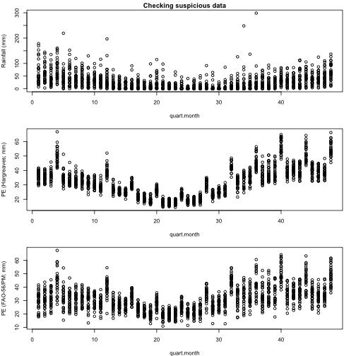

# Introduction

The 'PowerSDI' R-package calculates the Standardized Precipitation (SPI; @mckee1993) and Standardized Precipitation-Evapotranspiration (SPEI; @VicenteSerrano2010) indices using gridded-data from the NASA-POWER project.
The package includes functions (`ScientSDI()`, `Reference()`, `Accuracy()` and `PlotData()`), which evaluate how well the drought indices meet their conceptual assumptions.
The `OperatSDI()` function allows users to download NASA-POWER data for specific monitoring periods.
The package adopts a quasi-weekly basic time scale (`quart.month`), allowing for four index calculations per month: days 1 to 7, days 8 to 14, days 15 to 21, and days 22 to 28, 29, 30, or 31 depending on the month.
For instance, if the time scale is set to 4 (`TS = 4`), it corresponds to a moving window with a 1-month length that is calculated four times each month.
If `TS = 48`, the time scale corresponds to a moving window with a 12-month length that is calculated four times each month.
'PowerSDI' uses functions from the 'nasapower' [@Sparks2018; @Sparks2023] and 'Lmom' [@Hosking2023] packages.

# Basic Instructions: Getting Started

Load the library in your R session.


```r
library("PowerSDI")
```

## Using PlotData() to visually inspect NASA-POWER data

The `PlotData()` function allows a visual inspection of the indices' inputs (precipitation and potential evapotranspiration) obtained from the NASA-POWER project.
These inputs (in millimeters) are show at the 1-quart.month time scale.

## Example 1: Inspecting indices' input for Campinas-SP, Brazil


```r
PlotData(
  lon = -47.3,
  lat = -22.65,
  start.date = "1991-01-01",
  end.date = "2022-12-31"
)
#> Just a sec. Downloading NASA POWER data and calculating the others parameters.
```

<div class="figure" style="text-align: center">

<p class="caption">plot of chunk PlotData</p>
</div>

## ScientSDI(): Removing suspicious data and calculating the distributions's parameters

The first step of the SPI and SPEI algorithms is to calculate the cumulative probabilities of their input variables [@Guttman1999].
The `ScientSDI()` function estimates the parameters of the gamma, generalized extreme value (GEV), or generalized logistic distributions (GLO) through the L-moments method. This function also allows users to remove suspicious values from the data sample.

## Example 2: Applying the ScientSDI function for Campinas-SP, Brazil

The plots generated by the `PlotData()` function for Campinas revealed one suspicious rain value larger than 250 mm.
Since this suspicious record represents less than 1% of the data sample, we removed it from the analyses before calculating the parameters of the gamma and GEV distributions.
The PE data showed no suspicious values.


```r
Campinas <- ScientSDI(
  lon = -47.3,
  lat = -22.65,
  start.date = "1991-01-01",
  end.date = "2022-12-31",
  distr = "GEV",
  TS = 4,
  Good = "no",
  RainUplim = 250,
  RainLowlim = NULL,
  PEUplim = NULL,
  PELowlim = NULL
)
#> Just a sec. Downloading NASA POWER data and calculating the others parameters.
#> removed rowns:
#> [1] 420
```

Check the SDI values.


```r
head(Campinas$SDI)
#>   Year Month quart.month   Rain  PE.Harg    PE.PM  PPE.Harg    PPE.PM        SPI
#> 1 1991     1           4 244.61 170.7373 146.4035  73.87269  98.20646 0.09109635
#> 2 1991     2           5 314.52 162.4491 135.7954 152.07086 178.72457 1.03838634
#> 3 1991     2           6 323.98 155.9019 131.5357 168.07813 192.44427 1.33262036
#> 4 1991     2           7 300.04 151.1668 128.4917 148.87322 171.54828 1.01676070
#> 5 1991     2           8 209.40 135.6084 115.1231  73.79158  94.27689 0.47371145
#> 6 1991     3           9 240.75 128.9954 109.1543 111.75462 131.59571 1.08669958
#>    SPEI.Harg    SPEI.PM Categ.SPI Categ.SPEI.Harg Categ.SPEI.PM
#> 1 -0.1936137 -0.1557081    Normal          Normal        Normal
#> 2  0.8203645  0.8938564   mod.wet          Normal        Normal
#> 3  1.3080700  1.4026983   mod.wet         mod.wet       mod.wet
#> 4  0.9191998  0.9590826   mod.wet          Normal        Normal
#> 5  0.4402641  0.5283875    Normal          Normal        Normal
#> 6  1.0332707  1.1195075   mod.wet         mod.wet       mod.wet
```

Check the DistPar


```r
head(Campinas$DistPar)
#>        lon    lat quart.month alfa.rain beta.rain probzero.rain loc.harg  sc.harg
#> [1,] -47.3 -22.65           1  7.408528  29.87982             0 13.73669 74.65810
#> [2,] -47.3 -22.65           2  8.764616  27.03333             0 34.70563 77.84755
#> [3,] -47.3 -22.65           3  9.446275  24.96878             0 36.18940 71.86870
#> [4,] -47.3 -22.65           4  9.797904  25.09108             0 60.80831 88.85291
#> [5,] -47.3 -22.65           5  7.515294  30.45793             0 50.58664 98.79377
#> [6,] -47.3 -22.65           6  8.519209  25.71193             0 40.44269 87.16465
#>         sh.harg   loc.pm     sc.pm      sh.pm TS
#> [1,] 0.04643763 35.10085  77.23558 0.05326288  4
#> [2,] 0.10306409 54.98155  82.17268 0.12652166  4
#> [3,] 0.05582726 54.32006  75.73398 0.05512823  4
#> [4,] 0.35711219 80.30166  96.80879 0.39667736  4
#> [5,] 0.51834901 69.37979 106.06754 0.58681673  4
#> [6,] 0.42728104 55.63610  91.23542 0.44648066  4
```

## Accuracy(): Verifying how well NASA-POWER data actually represent real-world/observed data

A basic assumption related to remote sensing data is that they really represent the "real-world" conditions.
Thus, the `Accuracy()` function calculates the following measures of accuracy: the absolute mean error (AME), root-mean-square-error (RMSE), original (dorig), modified (dmod), refined (dref) Willmott's indices of agreement, and Pearson determination coefficient (R2).

## Example 3: Applying the Accuracy function to compare observed (obs) and NASA-POWER PE data in Campinas-SP, Brazil

In the example below, `data("ObsEst")` contains pairs of observed and estimated potential evapotranspiration (PE) data.
The observed and estimated data were obtained from a weather station in Campinas and from the NASA-POWER project, respectively.
PE was estimated using the Hargreaves & Samani method [@Hargreaves1985].


```r
data("ObsEst")

Compare_PE_Cps <- Accuracy(obs_est = ObsEst, conf.int = "No")

Compare_PE_Cps
#>       AME     RMSE     dorig      dmod     dref     RQuad
#>  2.470223 3.144231 0.9718557 0.8386579 0.838266 0.9590222

## OperatSDI(): Generating routine operational NASA-SPI and NASA-SPEI estimates

Considering that the parameters of the gamma (SPI) and GEV (SPEI) distributions have already been estimated by the `ScientSDI()` function, we can now use the `OperatSDI()` function to calculate these two indices on a routine basis.

## Example 4: Applying the OperatSDI function to calculate the SPI and SPEI in Campinas-SP, Brazil

The `OperatSDI()` function enables users to download NASA-POWER data only for the period they intend to monitor.


```r
parms <- Campinas$DistPar # Obtained in Example 2
SDI <- OperatSDI(
  lon = -47.3,
  lat = -22.65,
  start.date = "2023-08-01",
  end.date = "2023-08-07",
  parms = Campinas$DistPar,
  TS = 4
)
#> Calculating...

SDI
#>     Lon    Lat Year Month quart.month  Rain       PE       PPE         SPI       SPEI
#> 1 -47.3 -22.65 2023     7          27 15.85 83.34007 -67.49007 -0.16717343 -0.3608335
#> 2 -47.3 -22.65 2023     7          28 16.63 90.51523 -73.88523 -0.09507928 -0.2140795
#> 3 -47.3 -22.65 2023     8          29 16.50 98.82854 -82.32854 -0.23425126 -0.5376825
#>   Categ.SPI Categ.SPEI
#> 1    Normal     Normal
#> 2    Normal     Normal
#> 3    Normal     Normal
```

# Not So Basic Instructions:

## The ScientSDI(): Removing suspicious data and assessing the indices' conceptual assumptions

Standardized indices, both SPI and SPEI are expected to provide spatially consistent interpretations of their values [@Guttman1999].
Therefore, their frequency distributions are expected to always approach the standard normal distribution regardless of the region, season, or time scale at which the indices are calculated [@Wu2006; @Stagge2015; @Blain2017].
In this context, the ScientSDI function calculates two normality-checking procedures described by @Wu2006 and @Stagge2015.
Additionally, the calculation algorithm of the SPI and SPEI relies on fitting a parametric distribution to their input data.
Therefore, the `ScientSDI()` function also applies the widely-used Lilliefors [@Lilliefors1967] and Anderson-Darling [@Anderson1954] goodness-of-fit tests to the gamma and GEV/GLO distributions.
The function `ScientSDI()` allows users to select significance levels ranging from 5 to 10% to run these tests.
Additionally, the SPEI algorithm often uses the generalized extreme value (GEV) or the generalized logistic (GLO) [@VicenteSerrano2010; Begueria2013; @Stagge2015; @Stagge2015a; @VicenteSerrano2015; @Blain2017].
A review of these studies suggests that the performance of these two distributions for calculating the SPEI tends to be similar to each other over most of the range of the index possible values (e.g. -2.0:2:0).
However, these studies also found significant differences between the two probability functions in the lower and upper tails [@VicenteSerrano2015].
In this context, the `ScientSDI()` function also allows the users to choose between these two models when calculating the SPEI.

## Example 5.1: Applying the ScientSDI function with the GEV and verifying conceptual assumptions (Campinas-SP).


```r
Campinas.GEV <- ScientSDI(
  lon = -47.3,
  lat = -22.65,
  start.date = "1991-01-01",
  end.date = "2022-12-31",
  distr = "GEV",
  TS = 4,
  Good = "yes",
  sig.level = 0.95,
  RainUplim = 250,
  RainLowlim = NULL,
  PEUplim = NULL,
  PELowlim = NULL
)
#> Just a sec. Downloading NASA POWER data and calculating the others parameters.
#> removed rowns:
#> [1] 420
#> Calculating the goodness-of-fit tests. This might take a while.
```

Check the goodness of fit.


```r
head(Campinas.GEV$GoodFit)
#>       Lili.Rain      Crit Lili.PPEHarg      Crit Lili.PPEPM      Crit   AD.Rain
#> [1,] 0.11611448 0.1403616   0.09643114 0.1240349 0.10632197 0.1243881 0.6390502
#> [2,] 0.11600471 0.1400444   0.09792189 0.1254647 0.08309344 0.1290903 0.9182668
#> [3,] 0.13690470 0.1405725   0.13726836 0.1227916 0.13620839 0.1239727 0.8535305
#> [4,] 0.12338364 0.1361540   0.12333484 0.1215783 0.11852563 0.1192811 0.7133716
#> [5,] 0.05656565 0.1398411   0.06200571 0.1208659 0.05552784 0.1208139 0.1413624
#> [6,] 0.07813975 0.1395824   0.08737362 0.1222600 0.09892327 0.1226363 0.6182675
#>           Crit AD.PPEHarg      Crit  AD.PPEPM      Crit
#> [1,] 0.6939878  0.3436237 0.5071088 0.3620798 0.5505531
#> [2,] 0.7307045  0.3130080 0.5754704 0.2911684 0.6230571
#> [3,] 0.6988708  0.5908702 0.5715070 0.6880857 0.5645104
#> [4,] 0.7068771  0.6114124 0.5115975 0.6220234 0.4890652
#> [5,] 0.7256604  0.1526510 0.5025255 0.1144797 0.5124266
#> [6,] 0.7267055  0.2623157 0.5156586 0.3154090 0.5257243
```

Check the normality.


```r
head(Campinas.GEV$Normality)
#>      SPI.Shap            SPI.Shap.p           SPI.AbsMed           SPEI.Harg.Shap     
#> [1,] "0.967900296734504" "0.463209059642829"  "0.0997964641569041" "0.968381434185675"
#> [2,] "0.96619340372341"  "0.420858893940406"  "0.0104781137427235" "0.96598379125053" 
#> [3,] "0.975582768775711" "0.682405906920186"  "0.129821941048216"  "0.977751927154356"
#> [4,] "0.953414578207946" "0.180061525951205"  "0.168690442662682"  "0.97898007178251" 
#> [5,] "0.930008418348121" "0.0391836955173195" "0.291796230478461"  "0.966177284306965"
#> [6,] "0.940736018465501" "0.0785562689884901" "0.198234408496806"  "0.948926963769072"
#>      SPEI.Harg.Shap.p    SPEI.Harg.AbsMed       SPEI.PM.Shap        SPEI.PM.Shap.p     
#> [1,] "0.475655095743859" "0.146211503391456"    "0.968798285250625" "0.486612320909373"
#> [2,] "0.415857063151397" "0.0430601817586588"   "0.975597247176841" "0.682843863816165"
#> [3,] "0.747676360830804" "0.146518712288262"    "0.984353877822684" "0.918729743226727"
#> [4,] "0.76943094938649"  "0.000945230248407591" "0.975156717722481" "0.651747489854176"
#> [5,] "0.401103002082627" "0.116531691367401"    "0.967804350100986" "0.441114432322616"
#> [6,] "0.134350899150853" "0.0873165962027831"   "0.944436532965385" "0.100097027435286"
#>      SPEI.PM.AbsMed       SPI.testI  SPEI.Harg.testI SPEI.PM.testI SPI.testII
#> [1,] "0.165875549464531"  "Normal"   "Normal"        "Normal"      "Normal"  
#> [2,] "0.109628810903359"  "Normal"   "Normal"        "Normal"      "Normal"  
#> [3,] "0.122398459122704"  "Normal"   "Normal"        "Normal"      "Normal"  
#> [4,] "0.0378055330726613" "Normal"   "Normal"        "Normal"      "Normal"  
#> [5,] "0.106759663112335"  "NoNormal" "Normal"        "Normal"      "NoNormal"
#> [6,] "0.116250636027473"  "NoNormal" "Normal"        "Normal"      "Normal"  
#>      SPEI.Harg.testII SPEI.PM.testII
#> [1,] "Normal"         "Normal"      
#> [2,] "Normal"         "Normal"      
#> [3,] "Normal"         "Normal"      
#> [4,] "Normal"         "Normal"      
#> [5,] "Normal"         "Normal"      
#> [6,] "Normal"         "Normal"
```

## Example 5.2: Applying the ScientSDI function with the GLO and verifying conceptual assumptions (Campinas-SP).


```r
Campinas.GLO <- ScientSDI(
  lon = -47.3,
  lat = -22.65,
  start.date = "1991-01-01",
  end.date = "2022-12-31",
  distr = "GLO",
  TS = 4,
  Good = "yes",
  sig.level = 0.95,
  RainUplim = 250,
  RainLowlim = NULL,
  PEUplim = NULL,
  PELowlim = NULL
)
#> Just a sec. Downloading NASA POWER data and calculating the others parameters.
#> removed rowns:
#> [1] 420
#> Calculating the goodness-of-fit tests. This might take a while.
```

Check the goodness of fit.


```r
head(Campinas.GLO$GoodFit)
#>       Lili.Rain      Crit Lili.PPEHarg      Crit Lili.PPEPM      Crit   AD.Rain
#> [1,] 0.11611448 0.1397586   0.07793223 0.1241487 0.08361417 0.1268537 0.6390502
#> [2,] 0.11600471 0.1405247   0.07754312 0.1274113 0.07863811 0.1290056 0.9182668
#> [3,] 0.13690470 0.1394154   0.11096348 0.1285972 0.10719062 0.1264335 0.8535305
#> [4,] 0.12338364 0.1354406   0.10560516 0.1236261 0.10132682 0.1239152 0.7133716
#> [5,] 0.05656565 0.1404543   0.05057530 0.1246462 0.04670884 0.1250429 0.1413624
#> [6,] 0.07813975 0.1380100   0.11117785 0.1246797 0.12181073 0.1273072 0.6182675
#>           Crit AD.PPEHarg      Crit   AD.PPEPM      Crit
#> [1,] 0.6980925  0.2188857 0.5386847 0.21990399 0.5372656
#> [2,] 0.7339230  0.2930398 0.5609906 0.27915703 0.5670812
#> [3,] 0.7506145  0.4200223 0.5438093 0.51359779 0.5304125
#> [4,] 0.7100339  0.5535407 0.5270633 0.57487863 0.5323254
#> [5,] 0.7340188  0.1123251 0.5408325 0.09516567 0.5704610
#> [6,] 0.7168059  0.4195567 0.5441582 0.50640990 0.5529215
```

Check the normality.


```r
head(Campinas.GLO$Normality)
#>      SPI.Shap            SPI.Shap.p           SPI.AbsMed           SPEI.Harg.Shap     
#> [1,] "0.967900296734504" "0.463209059642829"  "0.0997964641569041" "0.957975177664532"
#> [2,] "0.96619340372341"  "0.420858893940406"  "0.0104781137427235" "0.95406119381055" 
#> [3,] "0.975582768775711" "0.682405906920186"  "0.129821941048216"  "0.967433566718497"
#> [4,] "0.953414578207946" "0.180061525951205"  "0.168690442662682"  "0.984528347009298"
#> [5,] "0.930008418348121" "0.0391836955173195" "0.291796230478461"  "0.978682738151819"
#> [6,] "0.940736018465501" "0.0785562689884901" "0.198234408496806"  "0.959942482488045"
#>      SPEI.Harg.Shap.p    SPEI.Harg.AbsMed       SPEI.PM.Shap        SPEI.PM.Shap.p     
#> [1,] "0.257666665512827" "0.145019334086898"    "0.958287373746254" "0.262679553360769"
#> [2,] "0.201842069277856" "0.0627635160125639"   "0.963904770879312" "0.368655164522459"
#> [3,] "0.451346104976285" "0.145955178216565"    "0.973867239035899" "0.630716833959293"
#> [4,] "0.915152409987227" "0.000176763112077816" "0.980772834566517" "0.821746577630312"
#> [5,] "0.760469725175666" "0.152757527602345"    "0.979154282323209" "0.774650833471448"
#> [6,] "0.273681510224376" "0.108922617832813"    "0.955969615793097" "0.212426831857326"
#>      SPEI.PM.AbsMed       SPI.testI  SPEI.Harg.testI SPEI.PM.testI SPI.testII
#> [1,] "0.167320419743562"  "Normal"   "Normal"        "Normal"      "Normal"  
#> [2,] "0.136043574288545"  "Normal"   "Normal"        "Normal"      "Normal"  
#> [3,] "0.119081676105265"  "Normal"   "Normal"        "Normal"      "Normal"  
#> [4,] "0.0481728658422679" "Normal"   "Normal"        "Normal"      "Normal"  
#> [5,] "0.149302751683921"  "NoNormal" "Normal"        "Normal"      "NoNormal"
#> [6,] "0.144631202606793"  "NoNormal" "Normal"        "Normal"      "Normal"  
#>      SPEI.Harg.testII SPEI.PM.testII
#> [1,] "Normal"         "Normal"      
#> [2,] "Normal"         "Normal"      
#> [3,] "Normal"         "Normal"      
#> [4,] "Normal"         "Normal"      
#> [5,] "Normal"         "Normal"      
#> [6,] "Normal"         "Normal"
```

## The Accuracy(): Applying the Accuracy function and calculating confidence intervals.

The `Accuracy()` function may also provide confidence intervals(CI) for AME, RMSE, dorig, dmod and dref.
As emphasized by @Willmott1985, the CI specifies a range of values within which these statistics are expected to vary by chance.
Consequently, users can interpret the magnitude of the CI as an indicator of the reliability of the estimated values for the comparison metrics @Willmott1985.
The function allows users to select between 90 and 95% CIs.

## Example 6: Applying the Accuracy function and calculating confidence intervals (Campinas-SP).


```r
data("ObsEst")
Compare_PE_Cps_withCI <-
  Accuracy(obs_est = ObsEst,
           conf.int = "yes",
           sig.level = 0.95)
#> Just a sec
Compare_PE_Cps_withCI
#>  AMECIinf      AME AMECIsup RMSECIinf     RMSE RMSECIsup dorig_CIinf     dorig
#>  2.466109 2.470223 2.472803  3.138613 3.144231  3.146912   0.9717394 0.9718557
#>  dorigCIsup dmodCIinf      dmod dmodCIsup dref_CIinf     dref dref_CIsup RQuad_CIinf
#>   0.9719229 0.8383641 0.8386579 0.8389186  0.8379565 0.838266  0.8385109   0.9589338
#>      RQuad RQuad_CIsup
#>  0.9590222   0.9592007
```

# References

Anderson, T.W., and Darling, D. A., 1954. A Test of Goodness of Fit. Journal of the American Statistical Association, 49:268, 765-769.  https://doi.org/10.2307/2281537

Beguería S., Vicente-Serrano S. M., Reig F., Latorre B., 2014. Standardized precipitation evapotranspiration index (SPEI) revisited: parameter fitting, evapotranspiration models, tools, datasets and drought monitoring. International Journal of Climatology, 34(10): 3001–3023. https://doi.org/10.1002/joc.3887

Blain, G. C., De Avila, A. M. H. and Pereira, V. R., 2018. Using the normality assumption to calculate probability based standardized drought indices: selection criteria with emphases on typical events. International Journal of Climatology, 38(S1), e418–e436. https://doi.org/10.1002/joc.5381

Guttman, N. B., 1999. Accepting the Standardized Precipitation Index: a calculation algorithm. Journal of the American Water Resources Association, 35, 311–322. https://doi.org/10.1111/j.1752-1688.1999.tb03592.x 

Hosking JRM (2022). L-Moments. R package, version 2.9, https://CRAN.R-project.org/package=lmom.

Lilliefors, H.W., 1967. On the Kolmogorov-Smirnov test for normality with mean and variance unknown. Journal of the American Statistical Association, 62, 399-402. http://dx.doi.org/10.1080/01621459.1967.10482916

Mckee, T. B., Doesken, N. J. and Kleist, J., 1993. The relationship of drought frequency and duration to time scales. In: 8th Conference on Applied Climatology. Boston, MA: American Meteorological Society, 179–184.

Sparks A (2023). nasapower: NASA-POWER Data from R. doi:10.5281/zenodo.1040727, R package version 4.0.10, https://CRAN.R-project.org/package=nasapower.

Sparks A (2018). “nasapower: A NASA POWER Global Meteorology, Surface Solar Energy and Climatology Data Client for R.” The Journal of Open Source Software, 3(30), 1035. doi:10.21105/joss.01035.

Stagge, J. H., Tallaksen, L. M., Gudmundsson, L., Van Loon, A. F. and Stahl, K., 2015. Candidate distribution for climatological drought indices (SPI and SPEI). International Journal of Climatology, 35:13, 4027–4040. https://doi.org/10.1002/joc.4267.

Stagge, J. H., Tallaksen, L. M., Gudmundsson, L., Van Loon, A. F., Sthal K., 2016. Response to comment on ‘Candidate Distributions for Climatological Drought Indices (SPI and SPEI)’. International Journal of Climatology, 36:4, 2132-2136. https://doi.org/10.1002/joc.4564

Vicente-Serrano S. M. and Beguería S., 2016. Comment on ‘candidate distributions
for climatological drought indices (SPI and SPEI)’ by James
H. Stagge et al. International Journal of Climatology, 36:4, 2120–2131. https://doi.org/10.1002/joc.4474.

Vicente-Serrano, S. M., Beguería, S. and Lopez-Moreno, J. I., 2010. A multiscalar drought index sensitive to global warming: the standardized precipitation evapotranspiration index. Journal of Climate, 23, 1696–1718.  https://doi.org/10.1175/2009JCLI2909.1.

Willmott, C. J., Ackleson, S. G., Davis, R. E., Feddema, J. J., Klink, K. M., Legates, D. R., O’donnell, J. and Rowe, C. M., 1985. Statistics for the evaluation of model performance. Journal of Geophysical Research, 90, 8995-9005. https://dx.doi.org/10.1029/JC090iC05p08995

Wu, H., Svoboda, M. D., Hayes, M. J., Wilhite, D. A., Wen, F., 2007. Appropriate application of the standardized precipitation index in arid locations and dry seasons. International Journal of Climatology, 27:1, 65–79. https://doi.org/10.1002/joc.1371.
